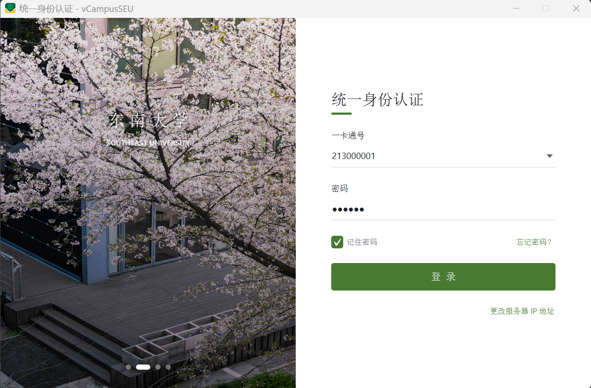
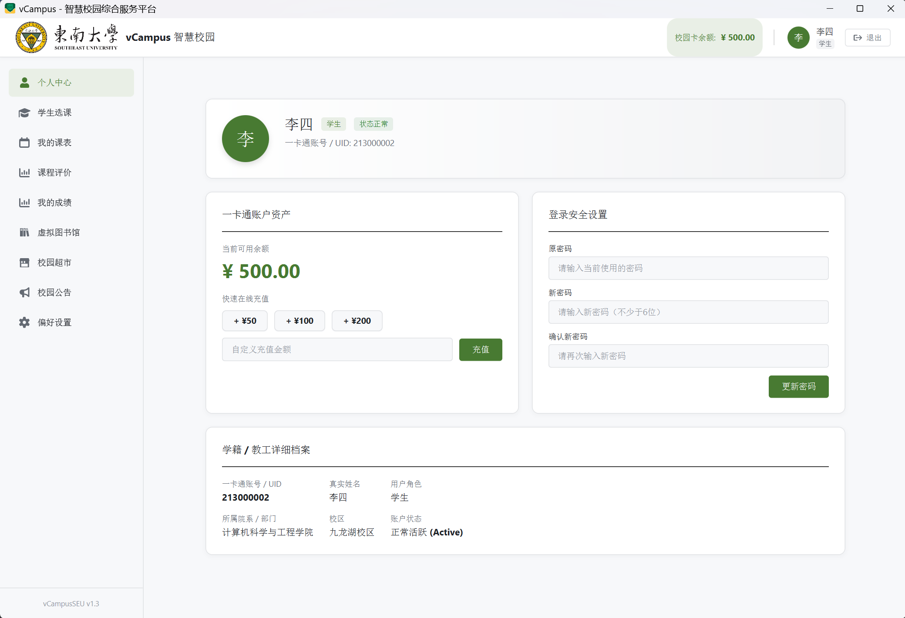

# vCampusSEU 虚拟校园系统

vCampusSEU 是一个基于 JavaFX、Socket 通信和 MySQL 的校园综合服务平台，面向学生、教师、教务老师、图书管理员、商店卖家和系统管理员提供统一登录、教务、图书馆、校园超市、公告和个人设置等功能。





## 技术栈

- Java 17
- JavaFX 17
- Maven 多模块
- Socket + 序列化消息通信
- MySQL 8
- Jsoup、Gson、Apache POI、PDFBox

项目模块：

```text
vCampusSEU
├─ common    公共实体、消息协议与工具
├─ server    服务端、业务逻辑与数据库访问
└─ client    JavaFX 客户端
```

## 环境要求

- JDK 17
- Maven 3.8+
- MySQL 8.0+
- Windows、macOS 或 Linux

确认环境：

```powershell
java -version
mvn -version
mysql --version
```

## 快速启动

### 1. 初始化数据库

按顺序执行以下 SQL 脚本：

```text
server/src/main/resources/database/000_vcampus_schema.sql
server/src/main/resources/database/001_bulk_accounts.sql
server/src/main/resources/database/002_bulk_courses.sql
server/src/main/resources/database/003_assign_course_teachers.sql
```

注意：`000_vcampus_schema.sql` 会删除并重新创建 `db_vcampus` 数据库，请勿在已有正式数据的环境中直接执行。

### 2. 配置数据库

修改：

```text
server/src/main/resources/db.properties
```

示例：

```properties
db.driver=com.mysql.cj.jdbc.Driver
db.url=jdbc:mysql://localhost:3306/db_vcampus?useUnicode=true&characterEncoding=UTF-8&serverTimezone=Asia/Shanghai&useSSL=false&allowPublicKeyRetrieval=true
db.username=root
db.password=你的数据库密码
```

### 3. 构建项目

在项目根目录执行：

```powershell
mvn clean package -DskipTests
```

预期生成：

```text
common\target\common-{version}.jar
server\target\server-{version}.jar
client\target\client-{version}.jar
```

客户端和服务端 JAR 由 Maven Shade 生成，已经包含 `common` 模块和运行依赖。

### 4. 启动服务端

```powershell
java -jar server\target\server-{version}.jar
```

启动成功后会显示：

```text
vCampusSEU Server 已启动，监听端口 8888
```

### 5. 启动客户端

另开一个终端：

```powershell
java -jar client\target\client-{version}.jar
```

默认服务器地址为 `127.0.0.1:8888`。如果服务端部署在其他电脑，在登录页点击右下角“更改服务器 IP 地址”，填写服务端 IP 和端口。

## 部署指南

### 局域网部署

1. 在服务器电脑安装 MySQL，并导入数据库脚本。
2. 修改服务端 `db.properties`，配置可用的数据库地址和账号。
3. 在项目根目录执行 `mvn clean package -DskipTests`。
4. 将服务端 JAR 复制到部署目录。
5. 启动服务端并确保防火墙放行 `8888` 端口。
6. 将客户端 JAR 分发给其他电脑。
7. 客户端登录时填写服务器电脑的局域网 IP。

### 无 Java 环境部署

使用 JDK 17 中的 `jpackage` 生成自带 JRE 的应用目录。

客户端：

```powershell
New-Item -ItemType Directory -Force dist\client-input
Copy-Item client\target\client-{version}.jar dist\client-input\

jpackage `
  --type app-image `
  --name vCampusSEU `
  --input dist\client-input `
  --main-jar client-{version}.jar `
  --main-class com.vcampus.client.ClientLauncher `
  --icon client\src\main\resources\images\comseucampus.ico `
  --dest dist\client `
  --add-modules java.desktop,java.logging,java.sql,java.naming,java.xml,java.security.sasl,jdk.crypto.ec,jdk.unsupported `
  --java-options "-Dfile.encoding=UTF-8"
```

服务端：

```powershell
New-Item -ItemType Directory -Force dist\server-input
Copy-Item server\target\server-{version}.jar dist\server-input\

jpackage `
  --type app-image `
  --name vCampusServer `
  --input dist\server-input `
  --main-jar server-{version}.jar `
  --main-class com.vcampus.server.ServerMain `
  --dest dist\server `
  --win-console `
  --add-modules java.desktop,java.logging,java.sql,java.naming,java.xml,java.security.sasl,jdk.crypto.ec,jdk.unsupported `
  --java-options "-Dfile.encoding=UTF-8"
```

生成的应用目录可直接复制到未安装 Java 的演示电脑。

## 演示用户

所有演示账号默认密码均为 `123456`。

| 角色 | 账号 | 姓名 | 建议演示内容 |
|---|---|---|---|
| 系统管理员 | `admin` | 系统管理员 | 用户注册、用户管理、角色与状态维护、密码重置 |
| 学生 | `213000001` | 张三 | 选课、课表、课程评价、成绩、图书馆、校园超市、公告 |
| 学生 | `213000002` | 李四 | 二手商品发布与购买、学生通用功能 |
| 教职工 | `100001` | 李教授 | 课程管理、授课课表、课程评分、成绩登记 |
| 教职工 | `100002` | 王教授 | 课程管理、授课课表、课程评分、成绩登记 |
| 教务老师 | `jwc_test` | 测试教务老师 | 全校课表、调课管理、开课审批 |
| 图书管理员 | `300001` | 图书管理员 | 借阅办理、归还办理、图书管理、资源审核 |
| 商店卖家 | `200001` | 高老板 | 商品新增、修改、删除、订单管理、二手市场 |

数据库还包含批量学生和教师账号，账号密码同样为 `123456`。批量学生账号从 `21324000003` 开始。

## 常见问题

### 客户端提示无法连接服务器

- 确认服务端已经启动并监听 `8888` 端口。
- 确认客户端服务器 IP 和端口填写正确。
- 检查服务器防火墙和局域网连通性。

### 服务端提示数据库连接失败

- 确认 MySQL 已启动。
- 检查 `db.properties` 中的地址、端口、用户名和密码。
- 确认已经按顺序初始化数据库脚本。

### `java -jar` 提示找不到主清单

确认使用的是 Maven Shade 生成的 `client-{version}.jar` 或 `server-{version}.jar`，而不是其他普通 JAR。

### 商品图片或电子资源上传失败

服务端运行目录需要具有写权限。建议从项目根目录启动服务端，确保 `ebooks` 和商品图片目录能够正常创建和写入。
