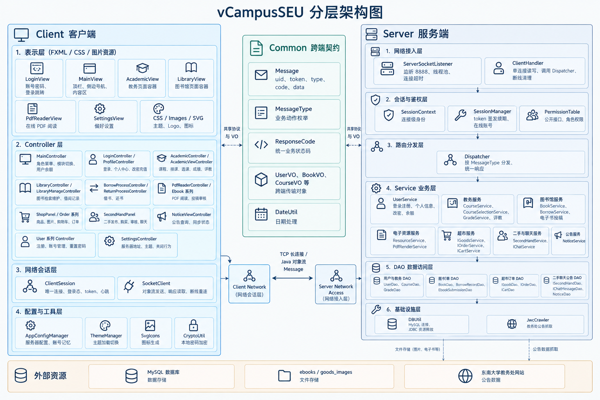
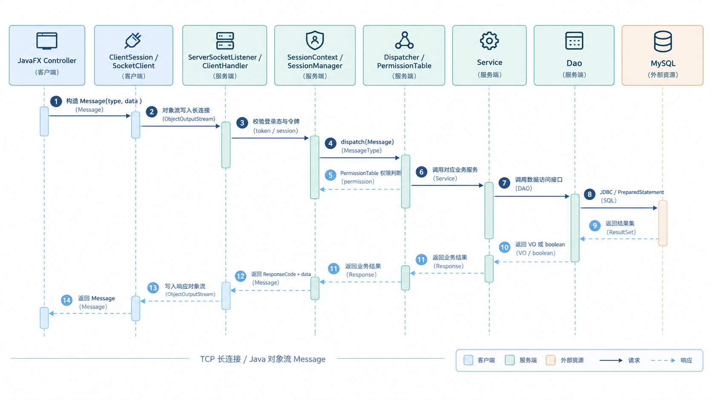

# vCampusSEU 智慧校园系统小组项目报告

**课程名称：** 暑期技能实训  
**项目名称：** vCampusSEU 智慧校园系统  
**组长：** 陶恒晖
**小组成员：** 高越 刘欣颖 撒昊天 朱芮珊

## 前言

vCampusSEU 智慧校园系统是一个面向校园日常场景的综合信息服务平台。项目围绕统一身份认证、教务管理、虚拟图书馆、校园超市、二手市场和校园公告等核心业务展开，试图在单一系统中整合校园用户最常使用的服务能力。项目采用客户端与服务端分离的总体结构，客户端使用 JavaFX 实现桌面端界面，服务端使用 Java Socket 提供长连接服务，公共模块统一维护通信协议和跨端数据对象，MySQL 负责持久化业务数据。

与传统的课程示例程序不同，本项目强调完整的数据流转和接近真实应用的使用体验。系统不仅包含简单的数据展示，还涉及权限控制、业务状态流转、文件上传下载、在线资源处理、异步通信、数据库事务和桌面端界面交互等实际工程问题。通过本项目的设计与实现，小组成员在需求理解、系统分层、接口约定、数据库建模、桌面端开发和团队协作等方面获得了较为完整的实践训练。

## 项目需求

### 功能需求

系统首先需要提供统一的身份认证与权限管理能力。不同身份的用户在登录后应进入符合其角色定位的工作界面，其中管理员负责系统维护和用户管理，教务老师负责课程审批与排课，教师负责课程维护和成绩录入，图书管理员负责图书馆业务，商店管理员和卖家负责商品与订单管理，学生则使用选课、成绩、图书馆、超市和二手市场等面向普通用户的功能。权限控制不仅体现在菜单可见性上，也应落实到服务端接口鉴权中，避免仅通过隐藏界面完成访问控制。

教务模块是系统的重要业务组成。教师能够提交和修改课程，教务老师能够对课程进行审批、驳回和排课，学生能够在开课范围内进行选课与退课并查看个人课表。课程完成教学后，教师可以按课程预设的成绩组成录入成绩，系统根据权重自动计算总评成绩和绩点，学生可以查询个人成绩，教师和教务人员可以查看课程成绩统计。此外，学生能够对已选课程提交评价，并查看其他学生对课程的评价。

虚拟图书馆模块需要同时支持实体书借阅和电子资源管理。馆藏图书支持按标题、作者、ISBN 和分类进行检索，用户可以查看图书详情、借阅状态和存放位置。借还书业务由图书管理员或学生自助完成，系统需要维护借阅记录、续借次数和逾期状态。电子书资源支持上传、审核、在线阅读和下载，其中在线阅读由服务端按页渲染，客户端只加载当前页面，以减少本地资源占用。馆藏列表采用分页和懒加载机制，避免在数据量较大时一次性传输全部记录。

校园超市模块围绕商品、购物车、订单和余额展开。管理员和卖家可以维护商品及商品图片，普通用户可以浏览商品、加入购物车并完成结算。系统需要在结算过程中同步校验库存和账户余额，避免超卖或余额不足。订单记录用于个人查询和管理端的统计分析。一卡通余额既是支付手段，也可由用户进行在线充值。

校园二手市场模块为校内用户提供闲置物品交易能力。学生可以发布二手商品，管理员对商品进行审核，审核通过后商品进入在售状态。其他用户可以浏览、购买商品，卖家可以修改价格或下架商品。为便于交易沟通，系统还提供了围绕二手商品的买卖双方聊天功能。

校园公告模块负责展示东南大学教务处公告。系统可以从教务处网站抓取公告，并对标题、日期、栏目和原文链接进行解析。用户能够按关键词和日期范围查询公告，管理员或用户触发手动同步，服务端也会按照固定周期执行后台自动同步，将新公告增量更新到本地数据库。

除上述业务模块外，系统还提供主题切换、偏好设置、服务器地址配置和系统托盘等通用功能，以提升桌面端应用的使用便利性。

### 非功能需求

从系统运行质量角度看，项目需要满足若干非功能性约束。客户端与服务端之间应使用长连接保持会话和身份一致，服务端应对全部业务接口进行统一鉴权和权限校验。数据库操作不应由客户端直接完成，而应统一放置在服务端数据访问层。网络请求必须避免阻塞 JavaFX 界面线程，界面更新应回到应用线程执行。系统对文件上传下载、路径解析和外部输入应进行必要的安全校验。对于图书、公告、商品等可能产生大量数据的列表，应采用分页或懒加载策略，以控制单次网络传输的数据规模。

## 项目设计与开发

### 总体架构

项目采用 Maven 多模块结构，整体划分为公共模块、客户端模块和服务端模块。公共模块负责定义通信报文、业务动作类型、响应状态码和各类传输对象，是客户端与服务端之间的契约层。客户端模块负责 JavaFX 界面、用户交互、网络请求和本地配置。服务端模块负责监听网络连接、完成身份认证和权限控制、分发业务请求、执行业务规则并访问数据库。

如图 1 所示，客户端内部可以进一步划分为表示层、Controller 层、网络会话层和基础设施层。表示层由 FXML、CSS、图片和 SVG 图标构成，负责页面布局和视觉表现；Controller 层承载登录、主界面、教务、图书馆、超市、二手和公告等业务交互；网络会话层维护全局唯一的客户端连接，并处理心跳、登录态和断线重连；基础设施层提供配置持久化、主题切换和图标生成等能力。

服务端内部则从网络接入层开始，经过会话鉴权层、路由分发层、业务层，最终到达数据访问层和基础设施层。网络接入层接收客户端连接并循环读取请求；会话鉴权层将身份绑定到具体连接，并通过令牌支持连接重建后的身份恢复；路由分发层根据请求类型将消息派发到对应业务服务；业务层完成具体业务规则；数据访问层通过 JDBC 与 MySQL 交互。图 1 的下方还标明了系统依赖的外部资源，包括 MySQL、电子书和商品图片文件存储，以及东南大学教务处网站。

### 通信设计

客户端和服务端之间使用 TCP 长连接进行通信，网络数据通过 Java 对象流传输统一的 `Message` 对象。`Message` 中同时包含请求方标识、登录令牌、业务动作类型、响应状态码和业务数据负载。服务端在处理请求时，身份来源以连接会话和令牌为准，而不采信客户端报文中的用户标识，从而避免伪造身份造成的越权访问。

图 2 描述了一次业务请求从客户端发起、经服务端处理并返回客户端的完整时序。客户端 Controller 首先构造请求报文，网络层将报文通过长连接发送给服务端；服务端接入层读取请求后完成会话校验，并将其交给 Dispatcher 进行鉴权和路由；Dispatcher 调用对应 Service，Service 再通过 Dao 访问 MySQL。数据库返回结果后，响应沿原路径返回给客户端，最终由界面线程更新页面。该图说明客户端不直接访问数据库，业务处理的鉴权位置位于服务端路由分发之前，数据访问被严格限制在服务端内部。

### 数据库设计

数据库围绕用户、教务、图书馆、超市、二手市场和公告等业务域组织。用户相关表保存账户、角色、余额和学生扩展信息。教务相关表保存课程、成绩组成、选课记录、总评成绩、单项得分和课程评价。图书馆相关表保存馆藏图书、借阅记录和电子书投稿信息，其中馆藏表新增图书分类字段以支持按类别筛选。超市相关表保存商品、订单和购物车数据。二手市场相关表保存二手商品、交易订单和买卖双方聊天记录。公告相关表保存教务处公告和同步元数据。上述表之间通过外键约束维持引用关系，关键业务使用唯一索引避免重复选课、重复成绩和重复购物车记录。

系统主要数据表如下表所示。

| 数据表 | 业务域 | 主要用途 | 主要字段说明 |
| --- | --- | --- | --- |
| `tbl_user` | 用户与账户 | 保存统一账户、角色、余额和账号状态 | `uid` 为主键，保存密码、角色、姓名、余额和状态 |
| `tbl_student` | 用户与账户 | 保存学生扩展档案 | 通过 `uid` 关联用户，保存院系、专业、班级和联系方式 |
| `tbl_course` | 教务管理 | 保存课程基本信息 | `course_id` 为主键，保存课程代码、教师、学分、学期、容量和排课信息 |
| `tbl_course_score_component` | 教务管理 | 保存课程成绩组成和权重 | 通过 `course_id` 关联课程，保存成绩项名称和权重 |
| `tbl_course_select` | 教务管理 | 保存学生选课记录 | 通过学生和课程外键关联，使用唯一索引避免重复选课 |
| `tbl_grade` | 教务管理 | 保存课程总评成绩 | 保存学生、课程、最终成绩、绩点和成绩状态 |
| `tbl_grade_score` | 教务管理 | 保存成绩组成单项得分 | 通过 `grade_id` 关联总评成绩，保存单项名称和得分 |
| `tbl_course_review` | 教务管理 | 保存课程评价 | 保存学生、课程、评分、评价内容和匿名状态 |
| `tbl_book` | 虚拟图书馆 | 保存图书馆藏信息 | `isbn` 为主键，保存书名、作者、出版社、分类、馆藏总数和可借余量 |
| `tbl_borrow_record` | 虚拟图书馆 | 保存图书借阅和续借记录 | 保存借书人、图书、借出日期、应还日期、归还日期和续借次数 |
| `tbl_ebook_submission` | 虚拟图书馆 | 保存电子书投稿和审核信息 | 保存上传人、书名、作者、资源文件、审核状态和审核意见 |
| `tbl_goods` | 校园超市 | 保存超市商品信息 | `goods_id` 为主键，保存商品名称、价格、库存、状态和图片 |
| `tbl_order` | 校园超市 | 保存商品消费订单 | `order_id` 为主键，保存购买人、商品、数量、金额和下单时间 |
| `tbl_cart` | 校园超市 | 保存购物车数据 | 保存用户和商品关联，使用唯一索引避免重复购物车记录 |
| `tbl_second_hand` | 二手市场 | 保存二手商品信息 | 保存卖家、商品标题、描述、价格、状态和发布时间 |
| `tbl_secondhand_price_log` | 二手市场 | 保存二手商品调价日志 | 保存商品、卖家、原价、新价和调价时间 |
| `tbl_second_hand_order` | 二手市场 | 保存二手交易订单 | 保存买家、卖家、商品、成交价和成交时间 |
| `tbl_chat_message` | 二手市场 | 保存买卖双方聊天记录 | 保存关联商品、发送者、接收者、消息内容和发送时间 |
| `tbl_notice` | 校园公告 | 保存教务处公告 | 保存公告标题、发布日期、栏目和原文链接 |
| `tbl_notice_meta` | 校园公告 | 保存公告同步元数据 | 以 `meta_key` 为主键，保存上次同步时间等配置信息 |

### 客户端界面设计

客户端采用 JavaFX 作为界面框架，使用 FXML 声明页面结构，使用 CSS 控制主题和视觉样式。主界面采用顶部用户信息栏、左侧导航栏和中间内容区的经典桌面端布局。登录成功后，主控制器根据用户角色构建导航菜单，并在内容区中动态加载对应业务模块。网络请求在后台线程中执行，响应通过 JavaFX 应用线程更新界面，从而避免长时间网络操作阻塞用户交互。对于馆藏图书等列表，客户端通过分页查询和滚动触发加载的方式实现懒加载，减少一次性传输的数据量。

### 开发过程

小组在开发过程中按照业务模块划分任务，并使用 Git 进行版本管理。功能开发在独立分支上进行，完成并验证后再合并回主分支。提交记录按照后端数据模型、客户端界面和独立功能等不同层次进行拆分，便于评审、定位和回滚。公共模块中的通信协议和数据对象作为前后端协作的接口约定，在开发早期确定，减少了后续集成阶段的重复沟通。

## 项目关键技术

项目在工程实现中使用了多种 Java 相关技术。Maven 多模块管理将公共协议、客户端和服务端分离，使不同模块可以独立编译和维护。JavaFX 提供了桌面端界面构建能力，FXML 负责页面结构，CSS 负责视觉样式，线程池和 `Platform.runLater` 保证了网络操作与界面更新的分离。客户端与服务端之间没有依赖现成的 Web 框架，而是使用 Java Socket 和对象序列化实现自定义通信协议，并通过心跳机制维护长连接。

在安全和身份管理方面，服务端使用会话上下文保存连接级身份，使用令牌支持断线重连后的身份恢复，并通过统一的权限表管理不同角色可访问的接口。数据库访问采用 JDBC 和 DAO 分层，Service 层不直接编写 SQL，数据访问统一使用 `PreparedStatement`，既保证了结构清晰，也降低了 SQL 注入风险。

在具体业务能力方面，系统使用 PDFBox 将服务端存储的 PDF 电子书按页渲染为图片，使客户端可以只获取当前阅读页。公告抓取使用 Jsoup 解析教务处网页，能够提取公告标题、日期、栏目和原文链接。图书列表使用分页查询和滚动懒加载，服务端根据关键字、分类和页码返回对应数据页，客户端在滚动到底部时继续请求下一页。此外，选课、借还书、下单和余额变动等关键业务通过事务或原子更新保证数据一致性。

## 项目经验及存在问题

### 经验

本次项目中，公共模块承担通信协议和传输对象的定义，使客户端和服务端能够围绕同一套契约独立开发，减少了重复定义和接口理解偏差。明确的分层结构使新增功能可以按照 Controller、Service、Dao 和数据库脚本的顺序推进，问题定位也更有依据。使用功能分支和多次小提交进行版本管理，使代码演进过程清晰，出现问题时可以快速回退。

在客户端实现方面，将网络请求放入后台线程并将界面更新切回 JavaFX 线程，有效改善了桌面端交互体验。在服务端实现方面，将身份鉴权统一放在路由分发之前，并避免信任客户端传入的用户标识，显著降低了越权风险。对于图书等列表数据，采用分页加载而不是一次性返回全部数据，为后续数据量增长保留了优化空间。

### 存在问题

当前系统仍存在一些可以继续改进的地方。客户端目前只维护一条长连接，慢请求执行期间其他请求会排队等待，电子资源上传或 PDF 渲染等耗时操作可能影响其他业务的响应速度。数据库初始化脚本以重建数据库为主，对已有数据库的增量升级支持不够友好，实际部署时需要更完整的迁移方案。图书懒加载目前采用分页方式，尚未做到严格意义上的仅渲染可视区域，在极端数据规模下仍有进一步优化空间。

此外，部分业务服务的抽象方式不完全统一，有的模块采用接口与实现分离，有的模块直接使用具体类，影响了代码风格的一致性。界面中的错误提示和异常处理仍有较多逻辑集中在 Controller 中，网络、文件和数据库异常的处理粒度也需要进一步细化。

### 团队沟通和工作方式

小组在项目过程中主要使用飞书进行日常沟通、任务同步和问题讨论，使用 GitHub 进行代码托管、分支管理和版本协作。成员按功能模块分工，各自在独立分支上开发，接口约定以公共模块中的通信类型、状态码和传输对象为准。遇到跨模块问题时，小组先在飞书中确认接口结构和业务规则，再分别完成客户端和服务端实现。这种工作方式减少了多人同时修改同一文件造成的冲突，也使每次提交的边界更加清晰。

### 技术理解

小组在项目结束后形成了统一的技术理解。系统可以被看作一条从界面交互到数据持久化的完整链路，客户端负责呈现和收集用户操作，服务端负责鉴权、业务处理和数据访问，公共模块负责维持两端一致的数据结构。一次请求从客户端 Controller 发出，经过网络层、服务端接入层、鉴权层和路由分发层，由 Service 完成业务逻辑，再由 Dao 完成数据库访问，最终沿原路径返回并更新界面。保持这种单向依赖和分层职责，是系统能够稳定扩展和多人协作的重要基础。

### 工作方式的解决

针对多人协作和代码管理中的问题，小组通过飞书保持及时沟通，通过 GitHub 管理代码版本，从而降低了并行开发带来的冲突风险。功能分支使不同模块能够同时推进，小步提交使每次改动更容易检查和回滚。公共模块作为接口契约，减少了前后端理解不一致的问题。后续还可以引入更完整的自动化测试、持续集成和代码评审机制，使开发流程更加规范和稳定。
